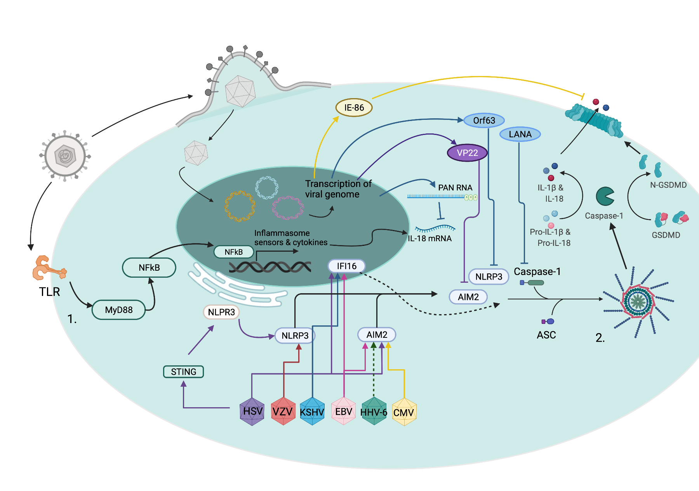

```{r setup, include=FALSE}
knitr::opts_chunk$set(echo = FALSE)

# Learn more about creating websites with Distill at:
# https://rstudio.github.io/distill/website.html

```

# Research Interests  

### The Innate Immune Response to Viral Infections

The innate immune response is the body’s first defense against pathogens.  My lab is interested in understanding how viruses activate and subvert this defensive system.  We work in a large collaborative environment studying herpes simplex virus, cytomegalovirus, SARS-CoV-2, and influenza.  Current areas of investigation include how these viruses activate inflammatory pathways, alter innate immune cell signaling, and interact with novel regulators of these pathways.

 

### Vaccine Response in Immunocompromised Hosts

Vaccines remain our best tool to prevent infection and disease.  Unfortunately, people with immunocompromising conditions (bone marrow or organ transplant recipients) often do not respond as well as immunocompetent individuals to vaccines.  This leaves them vulnerable to infection. My lab works with other investigators to understand the vaccine response in these immunocompromised patients and how we can improve that response to protect them from disease.

### [**Open Research Positions**](https://jobs.jhu.edu/job/Baltimore-Research-Technologist-MD-21212/778125600/)
      
# Transplant/Oncology Infectious Diseases
  My primary clinical focus is on preventing and treating infections in immunocompromised patients.  This includes bone marrow transplant recipients, solid organ transplant recipients, and patients undergoing chemotherapy treatment for cancer.  I see patients at Johns Hopkins Hospital and affiliated clinics.  I have a particular interest in novel treatments for viral infections in this population.
      
# Selected Publications

1. **Karaba AH**, Zhu X, Liang T, Wang KH, Rittenhouse AG, Akinde O, et al. A Third Dose of SARS-CoV-2 Vaccine Increases Neutralizing Antibodies Against Variants of Concern in Solid Organ Transplant Recipients. medRxiv. 2021; 2021.08.11.21261914. doi:10.1101/2021.08.11.21261914
2. Ruddy JA, Boyarsky BJ, Bailey JR, **Karaba AH**, Garonzik-Wang JM, Segev DL, et al. Safety and antibody response to two-dose SARS-CoV-2 messenger RNA vaccination in persons with HIV. AIDS. 2021. doi: 10.1097/QAD.0000000000003017
3. Woldemeskel BA, **Karaba AH**, Garliss CC, Beck EJ, Wang KH, Laeyendecker O, et al. The BNT162b2 mRNA Vaccine Elicits Robust Humoral and Cellular Immune Responses in People Living with HIV. Clinical Infectious Diseases. 2021. doi:10.1093/cid/ciab648
4. Ruddy JA, Boyarsky BJ, Werbel WA, Bailey JR, **Karaba AH**, Garonzik-Wang JM, et al. Safety and antibody response to the first dose of SARS-CoV-2 messenger RNA vaccine in persons with HIV. AIDS. 2021. doi:10.1097/QAD.0000000000002945
5. **Karaba AH**, Figueroa A, Werbel WA, Dioverti MV, Steinke SM, Ray SC, et al. Interleukin-18 and tumor necrosis factor-α are elevated in solid organ transplant recipients with possible cytomegalovirus end-organ disease. Transplant Infectious Disease. 2021. doi:10.1111/tid.13682
6. Peart Akindele N, Kouo T, **Karaba AH**, Gordon O, Fenstermacher KZJ, Beaudry J, et al. Distinct Cytokine and Chemokine Dysregulation in Hospitalized Children with Acute COVID-19 and Multisystem Inflammatory Syndrome with Similar Levels of Nasopharyngeal SARS-CoV-2 Shedding. The Journal of Infectious Diseases. 2021. doi:10.1093/infdis/jiab285
7. **Karaba AH**, Zhou W, Hsieh LL, Figueroa A, Massaccesi G, Rothman RE, et al. Differential Cytokine Signatures of SARS-CoV-2 and Influenza Infection Highlight Key Differences in Pathobiology. Clinical Infectious Diseases. 2021. doi:10.1093/cid/ciab376
8. Ignatius EH, Wang K, **Karaba AH**, Robinson M, Avery RK, Blair P, et al. Tocilizumab for the Treatment of COVID-19 Among Hospitalized Patients: A Matched Retrospective Cohort Analysis. Open Forum Infectious Diseases. 2021;8. doi:10.1093/ofid/ofaa598
9. Gladstone DE, Kim BS, Mooney K, **Karaba AH**, D’Alessio FR. Regulatory T Cells for Treating Patients With COVID-19 and Acute Respiratory Distress Syndrome: Two Case Reports. Annals of Internal Medicine. 2020. doi:10.7326/L20-0681
10. **Karaba AH**, Figueroa A, Massaccesi G, Botto S, DeFilippis VR, Cox AL. Herpes simplex virus type 1 inflammasome activation in proinflammatory human macrophages is dependent on NLRP3, ASC, and caspase-1. PLOS ONE. 2020;15: e0229570. doi:10.1371/journal.pone.0229570
11. **Karaba AH**, Blair PW, Martin K, Saheed MO, Carroll KC, Borowitz MJ. The Effects of a Systemwide Diagnostic Stewardship Change on West Nile Virus Disease Ordering Practices. Open Forum Infect Dis. 2019;6. doi:10.1093/ofid/ofz488
12. **Karaba AH**, Cohen LK, Glaubach T, Kopp SJ, Reichek JL, Yoon HH, et al. Longitudinal Characterization of Herpes Simplex Virus (HSV) Isolates Acquired From Different Sites in an Immune-Compromised Child: A New HSV Thymidine Kinase Mutation Associated With Resistance. Journal of the Pediatric Infectious Diseases Society. 2012. doi:10.1093/jpids/pis009
13. Edwards RG, Kopp SJ, **Karaba AH**, Wilcox DR, Longnecker R. Herpesvirus entry mediator on radiation-resistant cell lineages promotes ocular herpes simplex virus 1 pathogenesis in an entry-independent manner. mBio. 2015;6: e01532-15. doi:10.1128/mBio.01532-15
14. Kopp SJ, **Karaba AH**, Cohen LK, Banisadr G, Miller RJ, Muller WJ. Pathogenesis of neonatal herpes simplex 2 disease in a mouse model is dependent on entry receptor expression and route of inoculation. Journal of Virology. 2012. doi:10.1128/JVI.01849-12
15. Kopp SJ, Ranaivo HR, Wilcox DR, **Karaba AH**, Wainwright MS, Muller WJ. Herpes simplex virus serotype and entry receptor availability alter CNS disease in a mouse model of neonatal HSV. Pediatr Res. 2014;76: 528–534. doi:10.1038/pr.2014.135
16. **Karaba AH**, Kopp SJ, Longnecker R. Herpesvirus entry mediator is a serotype specific determinant of pathogenesis in ocular herpes. Proc Natl Acad Sci USA. 2012. doi:10.1073/pnas.1216967109
17. **Karaba AH**, Kopp SJ, Longnecker R. Herpesvirus entry mediator and nectin-1 mediate herpes simplex virus 1 infection of the murine cornea. Journal of Virology. 2011;85: 10041–10047. doi:10.1128/JVI.05445-11

[Complete Bibliography](https://www.ncbi.nlm.nih.gov/myncbi/andrew.karaba.1/bibliography/public/)

-----------------------------------------------
<font size="2"> © Copyright 2021 all rights reserved.<br>
This website was made using the Distill package in R.<br>
Learn more about using Distill for R Markdown at <https://rstudio.github.io/distill></font>
